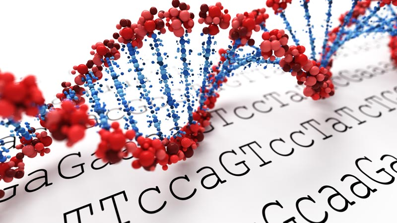
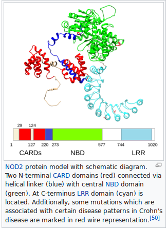

# **Final Project Documentation**

## DNA mutations
What will your genome sequence tell you about your actual risk for certain diseases? DNA sequencing has identified difficult-to-diagnose diseases in humans. So the main target of our project is to detect the abnormal DNA mutations which might be harmful, affect a person's characteristics and suspects the presence of diseases. 
so let's begin with some short notes about DNA sequence.
### Genome sequence


People are unique in large part because their genomes are unique. Most genome variations are relatively small and simple, the vast majority of the genome's sequence is the same from one person to the next, with the same genes in the same places. In other words, my genome is a pretty good approximation of yours, and if scientists sequenced your genome they would learn a lot about mine.
### Genome variations
During cell divition the genome sequence is said to be copied but maybe a wrong base is incorporated into the DNA sequence every once in a while, or a base or two might be left out or added, these variations aren't always harmful, they may not affect the person. variations that are located outside of genes—that is, the majority of genome variations—don't affect the way your body works.
#### sources of variations
Those variations come either from your parents and those variations are uniquely yours or variations arose many generations ago and have been passed down from parent to child over the years, until they ended up in you. You probably share each one of these older variations with many other people all over the world, but still, no one else has the exact same combination of variations that you have.
## Benifits of studying DNA sequence
studying DNA sequence has many practical applications, from genome mapping to screening for genetic diseases to forensic technologies such as DNA fingerprinting. Some of these applications, such as screening for genetic diseases, focus on the variations that affect a person's characteristics. Others, including genome mapping and DNA fingerprinting, make use of both variations that affect traits and those that do not. All of them involve, one way or another, analyzing a person's genome for the presence of specific variations. And such analysis isn't accurate or informative unless it's backed up by basic knowledge: how much variation exists in the genome, where it's located, and how common different alleles are in various population groups.
### Screening for genetic diseases
Diagnostic testing can be performed before birth or at any time during a person's life. 
### Diseases which can be detected through genome study
- **phenylketonuria:** a genetic test is conducted at birth that can identify babies who miss a gene in their DNA codes for an enzyme that allows them to break down a specific amino acid called phenylalanine found in milk. If these individuals receive regular milk or milk products, the unbroken phenylalanine will accumulate and cause brain damage.

- **Duchenne muscular dystrophy:** Muscle weakness; frequent falls; difficulty with motor skills (running, hopping, jumping); progressive difficulty walking (ability to walk may be lost by age 12); fatigue; intellectual retardation (possible); skeletal deformities; chest and back (scoliosis); muscle deformities (contractures of heels, legs; pseudohypertrophy of calf muscles). **DNA testing** is used to confirm the diagnosis; The muscle-specific isoform of the dystrophin gene is composed of 79 exons, and DNA testing and analysis can usually identify the specific type of mutation of the exon or exons that are affected.

- **Crohn's disease:** Inflammation confined to the colon; abdominal pain and bloody diarrhea; anal fistulae and peri-rectal abscesses can also occur.

 **Genetic mutations:** 


The first mutation found to be associated with Crohn's was a frameshift in the NOD2 gene (also known as the CARD15 gene), also other well documented genes which increase the risk of developing Crohn disease are ATG16L1, IL23R, IRGM, and SLC11A1.

- **Alzheimer's disease:** it is a degenerative disease of the brain that causes dementia, which is a gradual loss of memory, judgment, and ability to function. This disorder usually appears in people older than age 65 - late onset -, but less common forms of the disease appear earlier in adulthood - early onset -.
**early-onset Alzheimer disease:** most cases are caused by gene mutations that can be passed from parent to child.
It's caused by any one of a number of different single-gene mutations on chromosomes 21, 14, and 1. Each of these mutations causes abnormal proteins to be formed. Mutations on chromosome 21 cause the formation of **abnormal amyloid precursor protein (APP)**. A mutation on chromosome 14 causes **abnormal presenilin 1 (PSEN1)** to be made, and a mutation on chromosome 1 leads to **abnormal presenilin 2 (PSEN2)**, When any of these genes is altered, large amounts of a toxic protein fragment called **amyloid beta peptide** are produced in the brain. This peptide can build up in the brain to form clumps called **amyloid plaques**, which are characteristic of Alzheimer disease. A buildup of toxic amyloid beta peptide and amyloid plaques may lead to the death of nerve cells and the progressive signs and symptoms of this disorder.


## Used Algorithm
We found that the simplest way to construct our code to perfectly do the function we need which is finding the mismatch in the patterns of the genome, is to use data structure and algorithms that were already built specially for searching patterns and construction of the data in a certain way, so we used *suffix arrays* and *Burrows Wheeler Algorithm*.
### What is suffix array?
A suffix array is a sorted array of all suffixes of a given string.
- first, we divide the word (string ) into parts, each part is smaller that the previous one with one letter.
- then we give each of these parts an index in the array.
- then we sort these parts alphabetically to have our suffix. The next example will clear how it can be constructed for an array of strings.
##### **EXAMPLE**
```c++
Let the given string be "mutation".

0 mutation                         3 ation
1 utation    Sort the Suffixes     5 ion
2 tation      ---------------->    0 mutation 
3 ation      alphabetically        7 n
4 tion                             6 on
5 ion                              2 tation
6 on                               4 tion
7 n                                1 utation

So the suffix array for "mutataion" is {3, 5, 0, 7, 6, 2, 4, 1}
```
Now we will discuss the algorithm that we used suffix array in, which is Burrows wheeeler Transformation.
### What is Burrows Wheeler Algorithm?
It's a data transformation algorthim for data which rearranges a character string into runs of similar characters in an alphabetically way, it's also a  reversible operation without needing any more functions or data to restore the original string wich make it efficient in many applications. The following example will explain the steps to build the algorithm.
##### **EXAMPLE**
Using the word "mutation$" as an example.
       
 1. we cycle the given word (string) to get all the cyclic combinations.
```c++
         $   m                            mutation$
       n       u       Cyclic rotations   $mutation
     o           t        ---------->     n$mutatio 
       i      a                           on$mutati
          t                               ion$mutat
                                          tion$muta
                                          ation$mut
                                          tation$mu
                                          utation$m
```
 2. then we sort the cyclic combinations alphabetically.
```c++
  mutation$                             $mutation
  $mutation                             ation$mut
  n$mutatio                             ion$mutat
  on$mutati    alphabetically           mutation$ 
  ion$mutat    ------------->           n$mutatio
  tion$muta       sorting               on$mutati
  ation$mut                             tation$mu 
  tation$mu                             tion$muta
  utation$m                             utation$m
```
 3. Finally, we get the last coloumn.
```c++
the O/P of the transformation will be {ntt$oiuam}.

```
###### **NOTE** 
* We use the $ sign to indicate the end of the string which will help us when we reverse the transformation.
* we use the last coloumn specially because of the **last to front property** which includes that when we have the last coloumn we can retore the whole string by sorting it, for exmaple when we sort the last column we can get the first coloumn of the BWT.( explained in details in the next paragrapgh)

### Inverting Burrows Wheeler Transform
A great advantage of using BWT is that we can get the original string by only having the last column of the transorfm, for example.
```c++
when we have the word **mutation**
the BWT will be {ntt$oiuam}, If we sort it alphabetically we get the first column
 n                     $
 t                     a
 t                     i
 $  alphabetically     m
 o   ---------->       n
 i    Sorting          o
 u                     t
 a                     t
 m                     u
 so now we have the last and first cloumns. 

```
- then we put the first and last cloumns together and sort them alphabetically to get the first two cloumns of the transformation
```c++
 n$                             $m
 ta                             at
 ti                             io
 $m                             mu
 on       alphabetically        n$ 
 io        ---------->          on     
 ut          Sorting            ta  
 at                             ti
 mu                             ut
 Now we have the first two coloumns of the transformation matrix. 
 
```
- then if we add the last cloumn beside the first two cloumns and sort them we will get the first three cloumns and so forth we can get the whole matrix or in other words the original string.


### Implementation Burrows Wheeler Algorthim using Suffix array


## Applications of our algorithm
()
## Instruction to compile and run the source code

## References:
1. [Genome variations](http://www.genomenewsnetwork.org/resources/whats_a_genome/Chp4_1.shtml)
2. [Duchenne muscular dystrophy](https://en.wikipedia.org/wiki/Duchenne_muscular_dystrophy#DNA_test)
3. [Phenylketonuria](https://science.howstuffworks.com/life/cellular-microscopic/dna8.htm)
4. [other diseases](https://en.wikipedia.org/wiki/Genetic_testing#Specific_diseases)
5. [crohn's disease](https://en.wikipedia.org/wiki/Crohn%27s_disease#Genetics)
6. [Alzheimer's disease](https://www.nia.nih.gov/health/alzheimers-disease-genetics-fact-sheet)
7. [Suffix array](https://www.geeksforgeeks.org/suffix-array-set-1-introduction/)
8. [Burrows – Wheeler Data Transform Algorithm](https://www.geeksforgeeks.org/burrows-wheeler-data-transform-algorithm/)
9. [Burrows-Wheeler Transform](https://en.wikipedia.org/wiki/Burrows%E2%80%93Wheeler_transform)
10. [Using last Coloumn in BWT](https://softwareengineering.stackexchange.com/questions/314624/why-use-last-column-of-burrows-wheeler-transform/314629)
 n 
 t
 t
 $
 o
 i
 u
 a
 m

   alphabetically 
    ----------> 
     Sorting 
  

